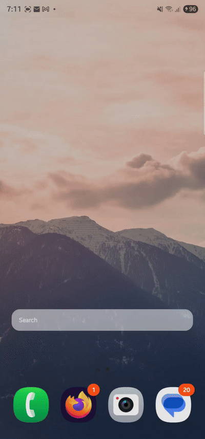

# Galaxy Finder Widget Enhanced

This is an enhanced fork of the [original Finder Widget by ris58h](https://github.com/ris58h/galaxyfinder-widget). It adds several customization options to the original Samsung Finder widget.

If you find this enhanced version useful, [buy me a coffee](https://buymeacoffee.com/xmansyx) ☕

## What's New in this Fork

- **Customizable widget appearance**:
  - Choose between dark, light, transparent, or custom background colors
  - Adjust background transparency
  - Select text color (dark, light, or custom)
  - Pick any custom colors using a color picker

- **Improved usability**:
  - Taller widget for better visibility and ease of use
  - Support for Samsung's widget reconfiguration (long-press to access settings)
  - Better theme handling for seamless appearance in both light and dark modes

- **Compatibility improvements**:
  - Works across all modern Samsung devices
  - Support for Android 13+ theme changes

## Installation
1. Download the [latest release APK](https://github.com/xmansyx/galaxyfinder-widget/releases/latest) from the Releases page.
2. Install the APK. Android will warn you about unknown source because the APK is self-signed.
3. Add the widget to your home screen and customize its appearance.

## Customization
1. Long-press on the widget after adding it to your home screen
2. Tap the settings icon or select "Settings"
3. Use the configuration screen to adjust:
   - Background color and transparency
   - Text color
   - Preview your changes in real-time

## Uninstallation
There are two options:
1. Long press on the homescreen widget then click info (i) then click `Uninstall`.
2. Select `Finder Widget` in `Settings > Apps` then click `Uninstall`.

## Credits
- Original widget created by [ris58h](https://github.com/ris58h/galaxyfinder-widget)
- Enhanced by [xmansyx](https://github.com/xmansyx)

If you enjoyed the original project, consider [buying a coffee for ris58h](https://www.buymeacoffee.com/ris58h).
If you like this enhanced version, [buy me a coffee](https://buymeacoffee.com/xmansyx) as well!
